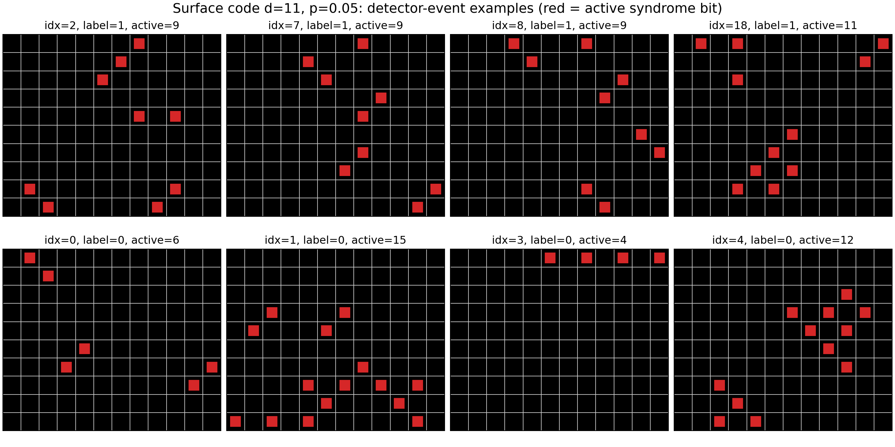
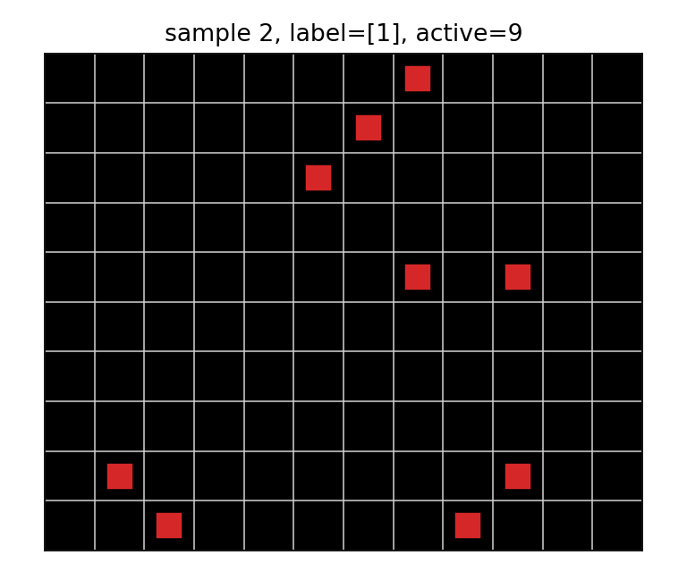
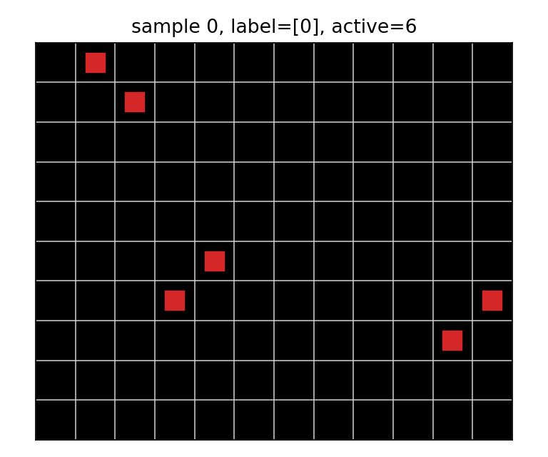
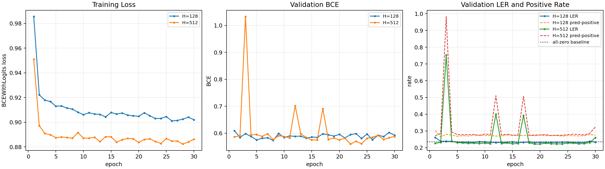

# Surface-Code CNN Decoder

This branch adds a small, self-contained surface-code code-capacity experiment. It is intended as
a machine-learning-first prototype for studying a simple syndrome-to-logical-action CNN decoder.

## Scope

The experiment trains a CNN decoder on a simplified surface-code task:

```text
sample iid binary errors e ~ Bernoulli(p)
syndrome = e @ H.T mod 2
logical_action = e @ L.T mod 2
learn syndrome -> logical_action
```

There is no measurement error and no time dimension. Stim is used to extract the rotated
surface-code parity-check matrix and logical-action matrix, but the dataset itself is generated by
iid binary sampling.

## Code Layout

```text
surface_code_capacity/
  data.py                         Dataset generation and NPZ loading
  model.py                        SurfaceCodeCNNDecoder architecture

scripts/
  generate_surface_code_iid.py    Generate train/validation NPZ files
  visualize_surface_code_samples.py
                                  Plot detector-event examples
  plot_surface_code_training.py   Plot training curves from metrics.jsonl
  train_surface_code_cnn.py       Train/evaluate the CNN decoder

configs/
  surface_iid_d11_p005.yaml       Dataset generation config
  train_surface_cnn_d11_h128.yaml H=128 training config
  train_surface_cnn_d11_h512.yaml H=512 training config

slurm/
  surface_code_train_h128.sbatch
  surface_code_train_h512.sbatch

reports/
  surface_code_cnn_findings.md
  surface_code_training_curves.png
  surface_iid_d11_p005_examples/
```

Large generated artifacts such as `.npz` datasets and `.pt` checkpoints should generally not be
committed to GitHub. The small metrics, summaries, figures, and documentation are the useful
review artifacts.

## Dataset

Configuration:

```text
config:        configs/surface_iid_d11_p005.yaml
code:          rotated surface code
distance:      d = 11
basis:         z
error rate:    p = 0.05
noise model:   iid data-error mechanisms only
measurement error: none
train shots:   200,000
val shots:     50,000
seed:          11 for train, 12 for validation
```

Generated dataset metadata:

```text
events shape:              [shots, 120]
labels shape:              [shots, 1]
num detectors:             120
num error mechanisms:      111
num logical observables:   1
detector grid shape:       10 x 12
train label positive rate: 0.236005
val label positive rate:   0.236320
mean active detectors:     9.17 train, 9.18 val
active detector p10/50/90: 4 / 9 / 14
```

Each input sample is a sparse binary syndrome vector of length 120. For visualization, the vector
is scattered onto a `10 x 12` detector grid. The label is a single binary logical action:

```text
0 = no logical flip
1 = logical flip
```

Example visualization:



In that figure, each red square is an active detector event. The first row shows label-1 examples
and the second row shows label-0 examples. The label is not determined by the number of red
squares; it depends on whether the underlying error chain has nontrivial logical action.

Two individual examples are also stored in the same folder:

| label | file | active detectors |
| --- | --- | ---: |
| 1 | `reports/surface_iid_d11_p005_examples/sample_00_idx_2.png` | 9 |
| 0 | `reports/surface_iid_d11_p005_examples/sample_04_idx_0.png` | 6 |





## Model

Implementation:

```text
surface_code_capacity/model.py
```

Architecture:

```text
binary syndrome [B, num_detectors]
-> nn.Embedding(2, H)
-> scatter detector embeddings to a [H, 10, 12] grid
-> L convolutional residual bottleneck blocks
-> check-to-data convolution
-> average pool over a logical-support mask
-> 2-layer MLP readout with hidden dimension 2H
-> one logit for logical_action
```

Residual bottleneck block:

```text
BatchNorm2d
GELU
1x1 Conv H -> H / bottleneck_ratio
BatchNorm2d
GELU
3x3 Conv
BatchNorm2d
GELU
Dropout2d
1x1 Conv -> H
residual add
```

Model sizes used:

| model | hidden dim H | blocks L | bottleneck ratio | dropout | parameters |
| --- | ---: | ---: | ---: | ---: | ---: |
| H=128 | 128 | 8 | 4 | 0.05 | 325,505 |
| H=512 | 512 | 8 | 4 | 0.05 | 5,135,873 |

Current limitation: the logical pooling mask is a simple detector-grid mask, not yet a fully
physical data-qubit logical support. This is acceptable for the prototype but should be improved
before treating the model as a serious decoder baseline.

## Training

Training script:

```bash
python scripts/train_surface_code_cnn.py --config configs/train_surface_cnn_d11_h128.yaml
python scripts/train_surface_code_cnn.py --config configs/train_surface_cnn_d11_h512.yaml
```

Loss:

```text
BCEWithLogitsLoss
```

The training config uses `pos_weight: auto`, so the positive class is up-weighted according to the
train-set class imbalance.

Optimizer and shared settings:

```text
optimizer:        AdamW
weight decay:     1e-5
epochs:           30
gradient clipping: 1.0
validation metric: logical_error_rate = any predicted logical bit != label
threshold:        sigmoid(logit) >= 0.5
```

H=128 config:

```text
batch size: 2048
lr:         3e-4
seed:       128
run dir:    runs/surface_cnn_d11_p005_h128
```

H=512 config:

```text
batch size: 1024
lr:         2e-4
seed:       512
run dir:    runs/surface_cnn_d11_p005_h512
```

Slurm runs:

```text
H=128 job: 9286087, completed, 00:03:15, exit code 0:0
H=512 job: 9286088, completed, 00:11:51, exit code 0:0
```

## Results

The all-zero baseline predicts no logical flip for every sample. Since the validation positive
rate is `0.23632`, the all-zero baseline has logical error rate approximately `0.23632`.

| model | best epoch | best val LER | final epoch LER | final val BCE | final pred-positive rate |
| --- | ---: | ---: | ---: | ---: | ---: |
| H=128 | 12 | 0.23026 | 0.23392 | 0.59248 | 0.27428 |
| H=512 | 19 | 0.22180 | 0.26202 | 0.58843 | 0.32134 |

Training curve:



Interpretation:

- H=128 only slightly improves over the all-zero baseline.
- H=512 reaches a better best checkpoint, `0.22180`, but the final epoch regresses to `0.26202`.
- The H=512 regression is visible in the prediction-positive rate: the final model predicts
  positives too often, producing more false positives.
- Use the best checkpoint for evaluation, not the final epoch.

## Reproduction Commands

Generate data:

```bash
python scripts/generate_surface_code_iid.py --config configs/surface_iid_d11_p005.yaml
```

Visualize examples:

```bash
python scripts/visualize_surface_code_samples.py \
  --data runs/data/surface_iid_d11_p005_val.npz \
  --out-dir reports/surface_iid_d11_p005_examples \
  --num-samples 8
```

Plot curves:

```bash
python scripts/plot_surface_code_training.py
```

Train on Slurm:

```bash
sbatch slurm/surface_code_train_h128.sbatch
sbatch slurm/surface_code_train_h512.sbatch
```

## Next Steps

1. Add an exact decoder baseline on the same generated dataset.
2. Replace the simple logical pooling mask with true data-qubit logical supports.
3. Add threshold calibration, early stopping, and learning-rate scheduling for H=512.
4. Sweep `p` and train on mixed error rates instead of only `p=0.05`.
5. Extend from no-measurement-error code-capacity data to spacetime/circuit-level data.
